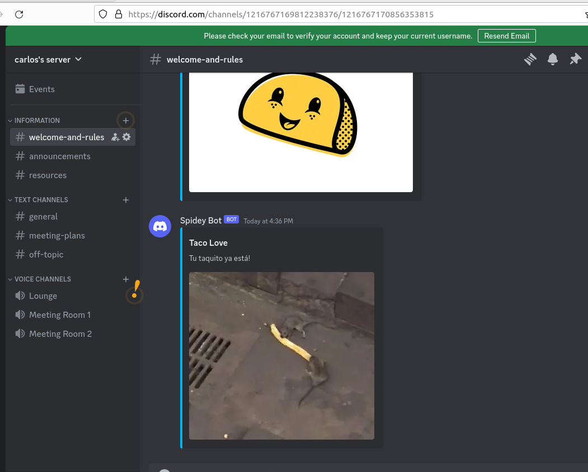
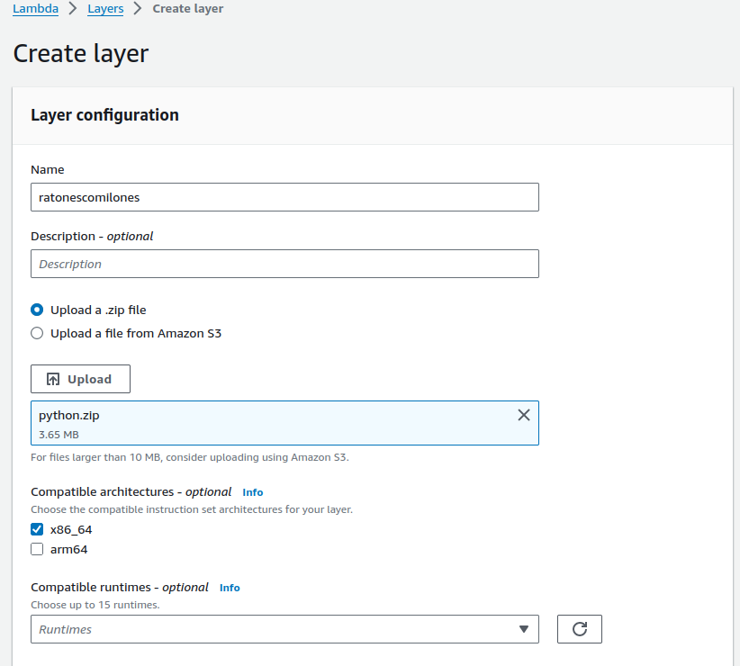
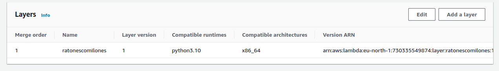
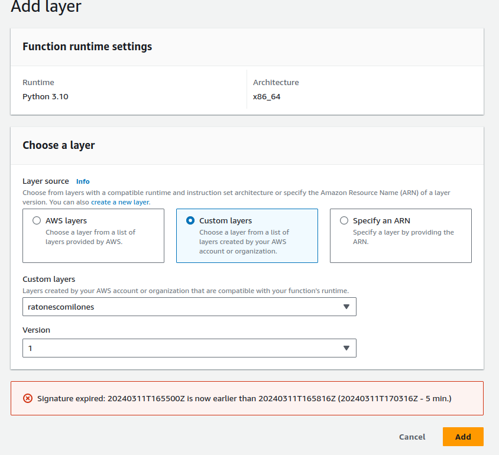
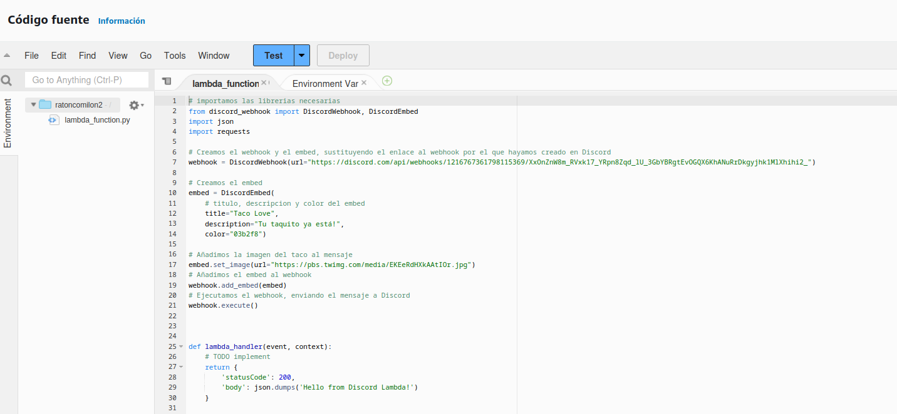

# AWSDiscord

En python hacemos un archivo .py con el siguiente codigo 

~~~
# importamos las librerias necesarias
from discord_webhook import DiscordWebhook, DiscordEmbed
import json
import requests

# Creamos el webhook y el embed, sustituyendo el enlace al webhook por el que hayamos creado en Discord
webhook = DiscordWebhook(url="aqui tenemos que poner la url de nuestro discord")

# Creamos el embed
embed = DiscordEmbed(
    # titulo, descripcion y color del embed
    title="Taco Love",
    description="Tu taquito ya está!",
    color="03b2f8")

# Añadimos la imagen del taco al mensaje
embed.set_image(url="https://pbs.twimg.com/media/EKEeRdHXkAAtIOr.jpg")
# Añadimos el embed al webhook
webhook.add_embed(embed)
# Ejecutamos el webhook, enviando el mensaje a Discord
webh
ook.execute()

def lambda_handler(event, context):
    # TODO implement
    return {
        'statusCode': 200,
        'body': json.dumps('Hello from Discord Lambda!')
    }
~~~

tendremos que descargar el repositorio de discord-webhook

~~~
pip install discord-webhook
~~~

con esto ya podriamos lanzarlo y que nos aparezca el mensaje en nuestro discord

Ahora para llevarlo a aws habra que hacer primero una capa, en ella tendremos que copiar y pegar la carpeta lib/

Así estaria listo para en el proyecto poner el codigo lanzarlo y que funcione

así ya estaria listo para lanzar y que nos mande el mensaje